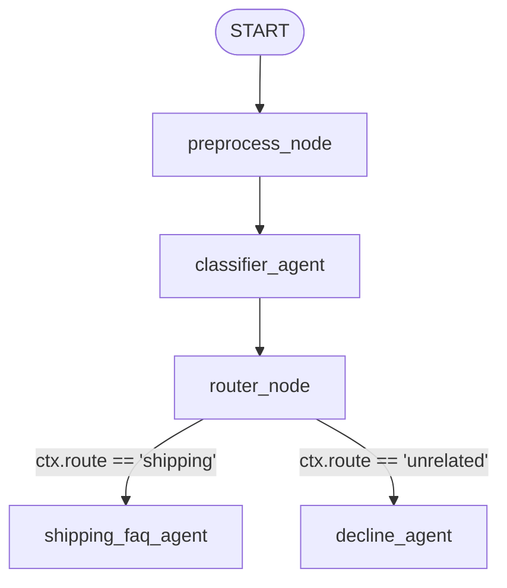

# customer-support-agent

Simple ReAct agent
Agent generated with `agents-cli` version `0.5.0`

## 📂 Project Structure

Below is the complete directory structure of the project:

```text
customer-support-agent/
├── app/                              # Core application code
│   ├── app_utils/                    # Utility scripts and helpers
│   │   ├── telemetry.py              # Telemetry, OpenTelemetry, and logging setup
│   │   └── typing.py                 # Pydantic schemas for feedback and requests
│   ├── agent.py                      # Main agent graph workflow definition
│   └── fast_api_app.py               # FastAPI wrapper for local playground and API hosting
├── tests/                            # Test suite
│   ├── eval/                         # Agent evaluation and golden dataset tests
│   ├── integration/                  # End-to-end integration tests
│   └── unit/                         # Unit tests for functions and agents
├── Dockerfile                        # Docker configuration for containerized deployment
├── GEMINI.md                         # AI development guidelines and context instructions
├── README.md                         # Project documentation and guide
├── agents-cli-manifest.yaml          # Configuration for the google-agents-cli tool
├── pyproject.toml                    # Poetry/Hatch/uv project configuration & dependency list
└── uv.lock                           # Lockfile for precise reproducible dependencies
```

---

## 🧠 Agent Architecture & Walkthrough (`app/agent.py`)

The agent is implemented using the **Google Agent Development Kit (ADK)**. It uses a graph-based stateful workflow to classify user incoming queries and route them to specialized agents.



### 1. State Schemas
ADK workflows use shared session states to store context and state between nodes.
*   **`WorkflowState`**: Retains the `user_query` string throughout the execution path so that downstream agents can retrieve the original query text.
*   **`Classification`**: A Pydantic model with a `category` field (`shipping` or `unrelated`). It serves as the structured output schema for the `classifier_agent`.

### 2. Nodes
Nodes represent individual processing units in the graph. In ADK, nodes can be either custom Python functions wrapped in a `FunctionNode` or instances of `Agent`.
*   **`preprocess_node` (`FunctionNode`)**: Captures the raw user query, stores it in the shared context (`ctx.state["user_query"]`), and forwards it.
*   **`classifier_agent` (`Agent`)**: An LLM-backed node using `gemini-3.1-flash-lite`. It analyzes the user input and forces a structured response adhering to the `Classification` schema.
*   **`router_node` (`FunctionNode`)**: A routing decision node. It inspects the `Classification` category. If the category matches `"shipping"`, it sets `ctx.route = "shipping"`; otherwise, it sets `ctx.route = "unrelated"`. It then returns the original user query.
*   **`shipping_faq_agent` (`Agent`)**: A dedicated customer support representative specializing in shipping rates, tracking, delivery status, and returns.
*   **`decline_agent` (`Agent`)**: A dedicated agent that politely declines to answer inquiries that do not relate to shipping.

### 3. Edges
Edges define how data and control flow between the nodes in the workflow graph:
*   **Linear Edges**: Sequential transitions from `START` to `preprocess_node`, then to `classifier_agent`, and finally to `router_node`.
*   **Conditional/Routed Edges**: The transition from `router_node` is defined as a dictionary mapping:
    ```python
    (router_node, {
        "shipping": shipping_faq_agent,
        "unrelated": decline_agent,
    })
    ```
    This directs the flow dynamically to either `shipping_faq_agent` or `decline_agent` based on the value set in `ctx.route`.

### 4. Tools
While the current configuration of the agent is pure routing and reasoning, ADK supports extending agent capabilities through **Tools** (Python functions, API clients, etc.).
*   **Role**: Tools allow agents to interact with external systems (e.g., querying database tracking tables, calculating rates dynamically).
*   **Configuration**: To add tools, you define a standard Python function and attach it to the `Agent` definition:
    ```python
    def get_tracking_status(tracking_id: str) -> str:
        # DB lookup logic here
        return "In Transit"

    shipping_faq_agent = Agent(
        ...,
        tools=[get_tracking_status]
    )
    ```

### 5. Root Workflow & App Wrapper
*   **`root_agent` (`Workflow`)**: Assembles the graph layout by taking in the `state_schema` and `edges` configuration.
*   **`app` (`App`)**: Wraps the `root_agent` to expose it as an ADK-compliant application, allowing the ADK CLI, Fast API app server, and playground to query the workflow.

> 💡 **Tip:** Use [Gemini CLI](https://github.com/google-gemini/gemini-cli) for AI-assisted development - project context is pre-configured in `GEMINI.md`.

## Requirements

Before you begin, ensure you have:
- **uv**: Python package manager (used for all dependency management in this project) - [Install](https://docs.astral.sh/uv/getting-started/installation/) ([add packages](https://docs.astral.sh/uv/concepts/dependencies/) with `uv add <package>`)
- **agents-cli**: Agents CLI - Install with `uv tool install google-agents-cli`
- **Google Cloud SDK**: For GCP services - [Install](https://cloud.google.com/sdk/docs/install)


## Quick Start

Install `agents-cli` and its skills if not already installed:

```bash
uvx google-agents-cli setup
```

Install required packages:

```bash
agents-cli install
```

Test the agent with a local web server:

```bash
agents-cli playground
```

You can also use features from the [ADK](https://adk.dev/) CLI with `uv run adk`.

## Commands

| Command              | Description                                                                                 |
| -------------------- | ------------------------------------------------------------------------------------------- |
| `agents-cli install` | Install dependencies using uv                                                         |
| `agents-cli playground` | Launch local development environment                                                  |
| `agents-cli lint`    | Run code quality checks                                                               |
| `agents-cli eval`    | Evaluate agent behavior (generate, grade, analyze, and more — see `agents-cli eval --help`) |
| `uv run pytest tests/unit tests/integration` | Run unit and integration tests                                                        |

## 🛠️ Project Management

| Command | What It Does |
|---------|--------------|
| `agents-cli scaffold enhance` | Add CI/CD pipelines and Terraform infrastructure |
| `agents-cli infra cicd` | One-command setup of entire CI/CD pipeline + infrastructure |
| `agents-cli scaffold upgrade` | Auto-upgrade to latest version while preserving customizations |

---

## Development

Edit your agent logic in `app/agent.py` and test with `agents-cli playground` - it auto-reloads on save.

## Deployment

```bash
gcloud config set project <your-project-id>
agents-cli deploy
```

To add CI/CD and Terraform, run `agents-cli scaffold enhance`.
To set up your production infrastructure, run `agents-cli infra cicd`.

## Observability

Built-in telemetry exports to Cloud Trace, BigQuery, and Cloud Logging.
